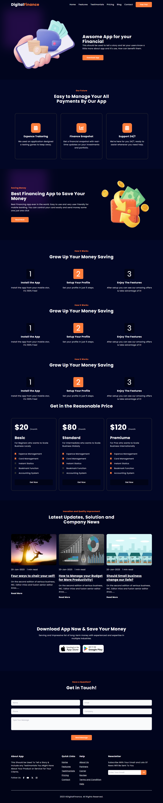

# DigitalFinance-App-UI-UX-Project
## Overview

## Purpose
I have created this project using TailwindCSS. The purpose of creating this project is to display my skills all over the world and also I want to polish my skills in TailwindCSS.

## Features
1. Responsive Design: Ensures optimal viewing experience across a wide range of devices.
2. Clean and Modern UI: Provides a sleek, contemporary look and feel.
3. Modular Components: Features reusable components for consistent design and functionality.
4. Utility-First CSS: Utilizes TailwindCSS for rapid UI development and easy customization.
